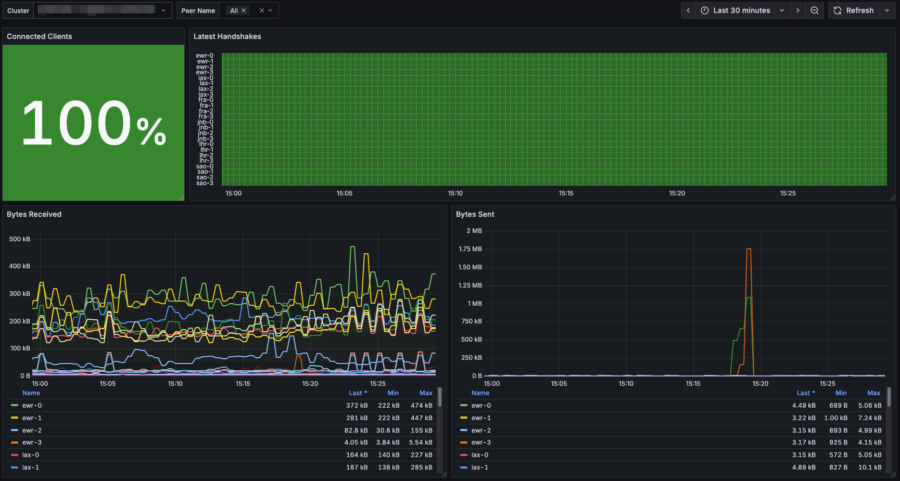

# Wireguard Operator


Painless deployment of wireguard on kubernetes

## Support and discussions

If you are facing any problems please open an [issue](https://github.com/nccloud/wireguard-operator/issues) or start a 
[discussion](https://github.com/nccloud/wireguard-operator/discussions) 

## Tested with
- [x] IBM Cloud Kubernetes Service
- [x] Gcore Labs KMP
  * requires `spec.enableIpForwardOnPodInit: true`
- [x] Google Kubernetes Engine
  * requires `spec.mtu: "1380"`
  * Not compatible with "Container-Optimized OS with containerd" node images
  * Not compatible with autopilot
- [x] DigitalOcean Kubernetes
  * requires `spec.serviceType: "NodePort"`. DigitalOcean LoadBalancer does not support UDP. 
- [ ] Amazon EKS
- [ ] Azure Kubernetes Service
- [ ] ...?

## Architecture 


## Features 
* Falls back to userspace implementation of wireguard [wireguard-go](https://github.com/WireGuard/wireguard-go) if wireguard kernal module is missing
* Automatic key generation
* Automatic IP allocation
* Does not need persistance. peer/server keys are stored as k8s secrets and loaded into the wireguard pod
* Exposes a metrics endpoint

## Example

### Server

```
apiVersion: vpn.wireguard-operator.io/v1alpha1
kind: Wireguard
metadata:
  name: "my-cool-vpn"
spec:
  mtu: "1380"
```

### Peer

```
apiVersion: vpn.wireguard-operator.io/v1alpha1
kind: WireguardPeer
metadata:
  name: peer1
spec:
  wireguardRef: "my-cool-vpn"
```

#### Peer configuration

Peer configurations are stored in a Secret named `<wireguard-name>-peer-configs`, one key per peer. Retrieve and decode like this:

```console
kubectl get secret my-cool-vpn-peer-configs -o jsonpath='{.data.peer1}' | base64 -d
```

Use the output to configure your preferred Wireguard client:

```console
[Interface]
PrivateKey = WOhR7uTMAqmZamc1umzfwm8o4ZxLdR5LjDcUYaW/PH8=
Address = 10.8.0.3
DNS = 10.48.0.10, default.svc.cluster.local
MTU = 1380

[Peer]
PublicKey = sO3ZWhnIT8owcdsfwiMRu2D8LzKmae2gUAxAmhx5GTg=
AllowedIPs = 0.0.0.0/0
Endpoint = 32.121.45.102:51820
```

## How to deploy
### Using provided manifest file
```
kubectl apply -f https://github.com/nccloud/wireguard-operator/releases/download/v2.9.0/release.yaml
```

### Using Helm
```
helm repo add nccloud https://nccloud.github.io/charts
helm install wireguard nccloud/wireguard-operator -n wireguard-system
```

You can use values to further customize the installation:
```
helm install wireguard nccloud/wireguard-operator -n wireguard-system --set nameOverride=wireguard
```

## How to remove
### Using provided manifest file
```
kubectl delete -f https://github.com/nccloud/wireguard-operator/releases/download/v2.9.0/release.yaml
```
### Using Helm
```
helm uninstall wireguard -n wireguard-system
```

## How to collaborate

This project is done on top of [Kubebuilder](https://github.com/kubernetes-sigs/kubebuilder), so read about that project
before collaborating. Of course, we are open to external collaborations for this project. For doing it you must fork the
repository, make your changes to the code and open a PR. The code will be reviewed and tested (always)

> We are developers and hate bad code. For that reason we ask you the highest quality on each line of code to improve
> this project on each iteration.
